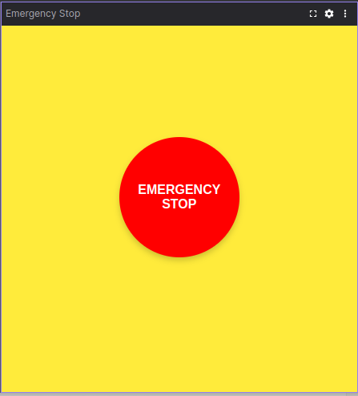

# EmergencyStop
<br>
## A Foxglove Studio Extension
このFoxglove Studioの拡張機能は、シンプルな非常停止ボタンを提供し、ROSシステムに対して非常停止信号を送信します。

# 機能

大きな非常停止ボタン
非常停止状態の視覚的フィードバック（ボタンの色が変化）
非常停止解除ボタン
カスタマイズ可能なトピック名
10Hzでの継続的な状態パブリッシュ

# インストール

.foxeファイルをダウンロード
Foxglove Studioにドラッグ＆ドロップしてインストール

# 使用方法

Foxglove Studioのパネル追加メニューから「Emergency Stop」を選択
必要に応じて設定（歯車アイコン）からトピック名を変更
赤いボタンを押すと非常停止信号を送信
緑のボタンで非常停止を解除

# ROSインターフェース

デフォルトトピック名：/emergency_stop
メッセージ型：std_msgs/Bool
パブリッシュ頻度：10Hz

# 開発者向け
```bash
git clone [repository-url]
cd foxglove-emergency-stop-extension
# 依存関係のインストール
npm install
```

## ビルド
```bash
npm run local-install
```
## foxeファイルを作成
```
npm run package
```